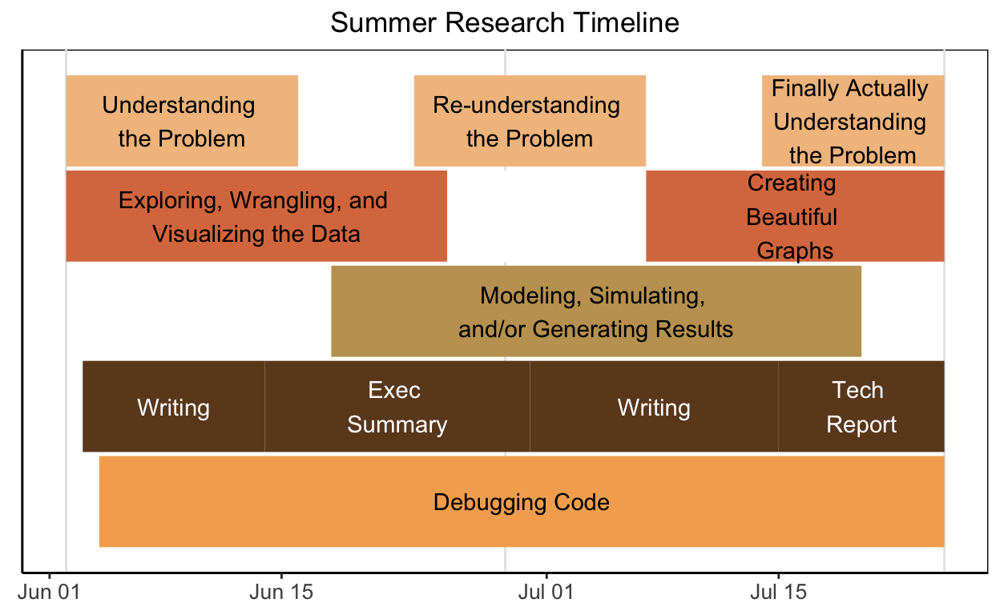
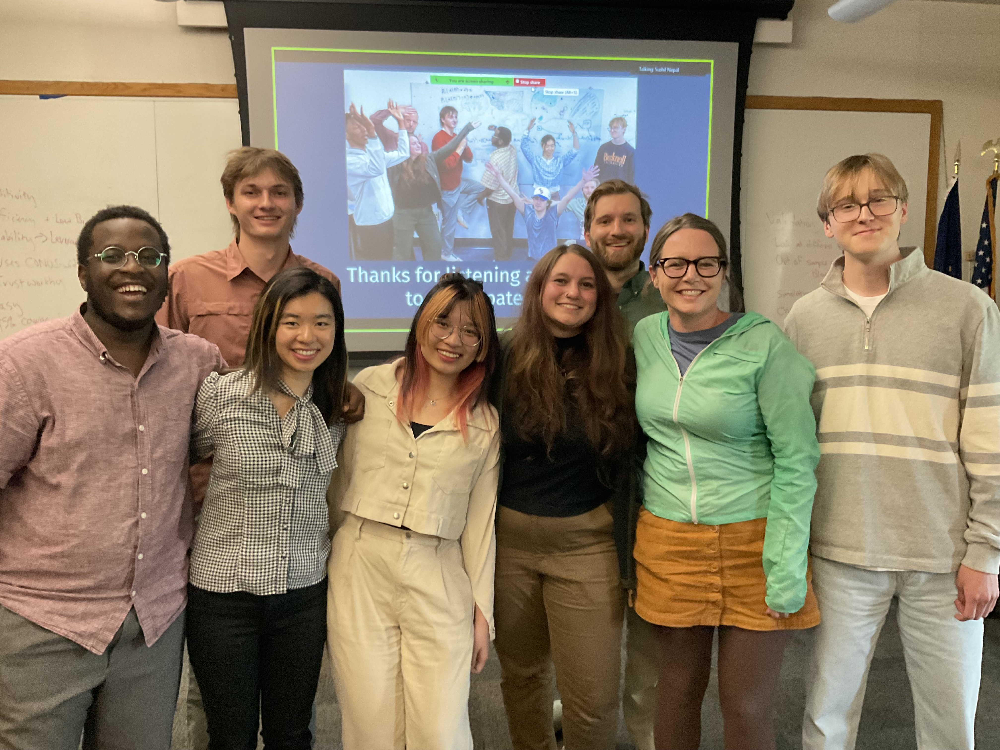

The Undergraduate Forestry Data Science (or, as we lovingly call it: "UFDS") program is a joint collaboration between the US Forest Service Rocky Mountain Research Station, Forest Inventory and Analysis Program (FIA), Bucknell University, and Reed College that engages undergraduate students with authentically motivated research questions in statistics, data science, and forestry. The co-directors of the program are [George Gaines](https://www.linkedin.com/in/george-gaines-7b34a711b/) (FIA), [Kelly McConville](https://mcconville.rbind.io/) (Bucknell), and [Grayson White](https://graysonwhite.com/) (Reed). In summer 2026, the UFDS program will be held at Reed College, but in the past the program has taken place at Whitman College, Swarthmore College, Reed College, Harvard University, and Bucknell University. 

FIA is responsible for monitoring the status and trends in forested ecosystems throughout the US.  As part of UFDS, students work on research questions generated by the FIA program and collaborate directly with research statisticians and foresters at FIA.  With the rise of new data sources, such as satellite imagery and large scale photography, and with the explosion of new statistical learning tools, a wealth of estimation techniques are available to consider. But with these new methods also come a load of important statistical questions related to robustness, bias, efficiency, and more!

Here’s a rough timeline of the summer research process:

```{r}
#| eval: true 
#| echo: false
#| fig-align: "center"
#| out-width: "65%" 
#| fig-alt: "graphic depicting an example summer research development timeline. The timeline spans from June 1 to July 30. The timeline has 5 rows of stacked blocks containing text. The bottom block spans the whole timeline and says 'Debugging Code' The second row up is broken into 4 roughly equal blocks which say from right to left 'Writing', 'Exec Summary', 'Writing', and 'Tech Report'. The third row has one block positioned between Jun 15 and July 30th which says 'Modeling, simulationg, and/or generating results'. The fourth row is broken into two chunks, the first sits in the first half of June and says 'Exploring, wrangling, and visualizing the data'. The second sits in the last week and say 'Creating beautiful graphs'. The fifth row is broken into three blocks. The first sits at the beginning in June and says 'Understand the problem.' The second sits detached in the middle of the row around July 1 and says 'Reunderstanding the problem'. The third sits at the end of the row around July 15th and says 'Finally Actually understanding the problem'."

```

In addition to the activities listed in the research timeline, we also give presentations about our work and eat ice cream!

::: {layout-ncol=2}
{width=45%} 

{width=45%}
:::


